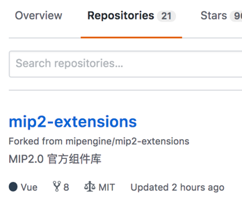
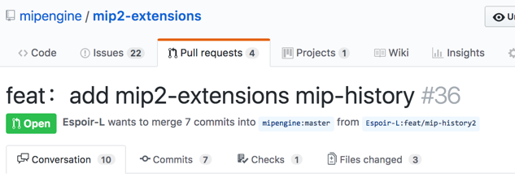

# 如何贡献组件代码

当前 MIP 的组件有内置组件、官方组件、站长组件几部分。其中，内置组件不支持开发者提交修改，官方组件是官方提供的较为通用的组件，开发者也可以通过 Pull Request 的方式修改提交。站长组件则是为了满足站点特殊定制化需求而提供的。下面我们分别介绍如何提交这两部分组件。

## 提交组件到官方组件仓库

当前 MIP 的官方组件在[Github](https://github.com/mipengine/mip2-extensions)上托管，开发者可以通过提交 Pull Request 的方式来贡献优秀的组件。

### 步骤

1.**fork 官方组件仓库**

首先，浏览器进入 GitHub 中 MIP 官方组件代码仓库：`https://github.com/mipengine/mip2-extensions`。点击右上角的 fork 按钮，如下图所示，如果你认为 MIP 项目做得还不错，欢迎为MIP项目贡献 star。


fork 完成后，在你 GitHub 主页下的 Repositories 下会多出一个 mip2-extensions 仓库，如下图：



将仓库 `clone` 到本地

```bash
$ git clone https://github.com/your-username/mip2-extensions.git
```

2.**开发**

`git clone` 出来的项目结构与 `mip2 init` 命令初始化的项目结构类似，我们可以在根目录使用 `mip2 add` 命令新增组件。

- [组件开发](../development/component-syntax.md)
- [调试](../debug/mip-dev.md)
- [校验](./mip-cli-usage.md#组件和页面校验)

开发完成后提交：

```bash
# add需要提交的文件
$ git add XXX.js
# commit需要提交的文件
$ git commit -m 'update_log...'
# pull 保持和远程分支一致
$ git remote add upstream https://github.com/mipengine/mip2-extensions.git
$ git pull upsteam master
# push 本次提交
$ git push
```

3.**发起 Pull Request**

开发完成后，[发起 pull Request](https://help.github.com/articles/creating-a-pull-request-from-a-fork/)

进入自己 fork 的仓库，点击 New pull request 按钮:


按照提示，完成提交。最终会在官方仓库提交一个 Pull request



Pull request 提交后，会自动触发持续集成的任务，如代码规范检查、部署预览等，在 Conversation 选项卡可以看到实时状态。如果有不通过的，需要再次修改提交，确保所有检查项都成功通过，官方才能审核合入。


4.**官方审核通过，合入上线**

官方开发人员操作合入之后，代码最终 merge 到官方库，在此过程中可关注官方开发人员的评论，积极参与讨论，共同为 MIP 组件贡献良好的代码。

5.**调用组件脚本**

```
// 页面中引用
<script src="https://c.mipcdn.com/static/v2/mip-example/mip-example.js"></script>
```

## 提交站长组件

### 站长组件仓库说明

与 MIP 1.0 采用的方式不同，MIP 2.0 以项目（一个站点）的粒度来管理站长组件。每一个项目（使用 `mip2 init` 命令生成）中包含了这个站点所需的所有自定义组件。

MIP 2.0 的站长组件托管在 [Github 站长组件仓库](https://github.com/mipengine/mip2-extensions-platform)，项目结构大致如下：

```bash
├──sites
    ├── test.a.com
    │   ├── common
    │   ├── components
    │   ├── example
    │   ├── mip.config.js
    │   ├── node_modules
    │   ├── package-lock.json
    │   ├── package.json
    │   └── static
    └── test.b.com
        ├── common
        ├── components
        ├── example
        ├── mip.config.js
        ├── package-lock.json
        ├── package.json
        └── static
├── LICENSE
└── README.md

```

`sites` 目录即是站点项目的集合。示例中已经托管了 `test.a.com` 和 `test.b.com` 两个站点的自定义组件。站长各自在其 `components` 目录下[编写组件](./start-writing-first-mip.md#编写-mip-组件)。

本地需求实现并测试无误后，通过 `Pull Request` 的方式（暂时方案）提交审核，官方通过审核后会定期编译上线。

供站点使用的最终发布地址为：

```bash
https://c.mipcdn.com/extensions/platform/v2/{站点项目名}/{组件名}/{组件名}.js

# 例如 test.a.com 下的 mip-example 组件

https://c.mipcdn.com/extensions/platform/v2/test.a.com/mip-example/mip-example.js
```

### 站长组件开发、提交流程

1.**fork 站长组件仓库**

首先，浏览器进入 GitHub 中 MIP 官方组件代码仓库：`https://github.com/mipengine/mip2-extensions-platform`。点击右上角的 fork 按钮，fork 完成后，在你 GitHub 主页下的 Repositories 下会多出一个 mip2-extensions-platform 仓库。

2.**开发**

我们进入 `sites` 目录，如果是第一次提交一个站点的组件，运行命令

```bash
$ mip2 init
```

按照提示输入项目名称，如 `cafe.com`，新增了一个站点项目。

```bash
$ cd cafe.com
```

切换到站点项目目录即可快速进行组件开发工作了：

- [新增组件](./mip-cli-usage.md)
- [调试组件](./mip-cli-usage.md#启动调试服务器)
- [校验组件](./mip-cli-usage.md#组件和页面校验)

3.**发起 Pull Request**

开发完成后，[发起 pull Request](https://help.github.com/articles/creating-a-pull-request-from-a-fork/)。进入自己 fork 的仓库，点击 New pull request 按钮，按照提示，完成提交。最终会在官方仓库提交一个 Pull request。Pull request 提交后，会自动触发持续集成的任务，如代码规范检查、部署预览等，在 Conversation 选项卡可以看到实时状态。如果有不通过的，需要再次修改提交，确保所有检查项都成功通过，官方才能审核合入。


4.**官方审核通过，合入上线**

官方审核通过后，代码将合入 `master` 分支并上线。若不通过，请根据反馈修改后再次提交。

5.**调用组件脚本**

```
// 页面中引用
<script src="https://c.mipcdn.com/extensions/platform/v2/{站点项目名}/{组件名}/{组件名}.js"></script>
```
